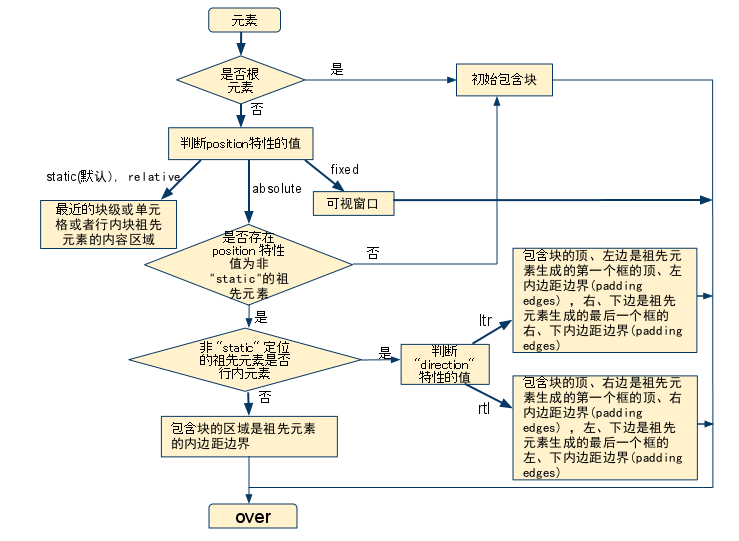
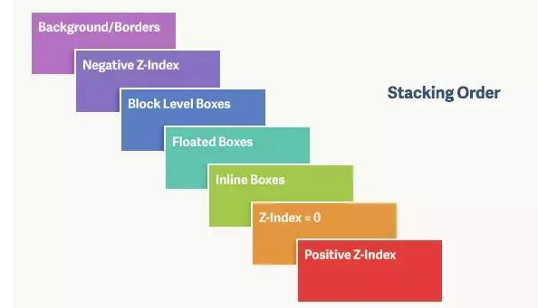

---
#CSS特性值
*   整数  //z-index
*   数字 
*   长度
    -   相对长度——em(元素上的font-size)/ex(小写x的高度)/px
    -   绝对长度——in/cm/mm/pt/pc
    -   百分比——（与其它值有关）
*   URL/URI //url(...)
*   计数器   //从IE8才开始支持,`counter(<identifier>[,<'list-style-type'>])`
*   颜色  // rgb/rgba/16/keyword 超过有效范围的值，应该被处理为可用范围内的值　
*   字符串 单引号/双引号　

---

#CSS 解析错误的处理规则

对于未知的特性和不合法的值，用户端都忽略此声明。
不可用的@关键字类似于未知的特性。
缺少了闭合的大括号，浏览器应该自动补齐。
若值为字符串，引号却没有闭合，用户端应该在一行的结尾处，闭合字符串，一般都是以分号结尾。

---

#CSS的特性值
*   指定值——确定
*   计算值——继承用
*   使用值——绝对的
*   实际值——显示在客户端

###指定值
*   层叠顺序的选择器
*   继承
*   初始值

###计算值
*   URI被解析为绝对地址
*   em,ex被解析

###使用值
*   使用值是将计算值和有依赖关系的值最终转化成的绝对的值
*   "计算出的样式"
*   Js获取的

###实际值
*   成为渲染所需要的值
*   Firefox 采用了四舍五入的形式，Chrome 中却会直接取整

---

#CSS选择器优先级

##'!important' 

'!important' 规则在 IE7 以前的版本中是被支持不完善。

样式表可能有三种不同的来源：作者、用户和用户端。
作者就是开发者，用户就是使用浏览器的人，用户端就是浏览器。

*   用户样式表——这个样式表是使用浏览器的用户，根据自己的偏好设置的样式表。
*   用户端样式表——来自浏览器的样式，被称作 UA style，是浏览器默认的样式。
*   作者样式表——即开发者在开发网页时，所定义的样式表。

为了找到元素/特性组合的值，用户端必须应用如下的排列顺序：
根据 CSS 样式的来源和重要性(是否含 !important )，给出了优先级的升序排列：
*   用户端声明( UA declarations )
*   一般用户声明( user normal declarations )
*   一般作者声明( author normal declarations )
*   加了 '!important' 的作者声明( author important declarations )
*   加了 '!important' 的用户声明( user important declarations )
拥有相同重要性和来源的规则，按照CSS优先级来排序。

最后，根据先后次序来排列：如果两条规则具有相同的权重，相同的来源和相同的选择器特殊性，则后出现的规则超越先出现的规则。

引入的样式表( @import )中的规则被认为出现在样式表本身的所有规则之前。

##计算选择器的特殊性( Selector's specificity )

根据层叠顺序，优先级相同的样式，如何判断哪一条声明会起作用，取决于对其选择器特殊性的计算值。

a，b，c，d 值的确定规则：

*   `行内样式`如果 HTML 标签的 'style' 属性中该样式存在，则记 a 为 1；
*   `ID`数一下选择器中 ID 选择器的个数作为 b 的值。比如，以上样式中包含 '#c1' 和 '#c2' 的选择器；
*   `属性class选择`其他属性以及伪类（pseudo-classes）的总数量是 c 的值。比如，上面例子中的 '.con'，':hover' 等；
*   `元素`元素名和伪元素的数量是 d 的值；比如上面例子中的 ‘div’。

多个类选择器叠加（256）之后的优先级大于一个id选择器

用户端应该优先考虑那些不是来自样式表的显示属性。如果是这样，这些非CSS呈现提示必须被转换到相应的CSS规则，且其特殊性为零，并认为它的引入处于样式表的最顶端。它们可能被后续的样式规则所覆盖:

>在 HTML 中，任何不属于以下列表中的属性都需要以显示属性对待：abbr, accept-charset, accept, accesskey, action, alt, archive, axis, charset, checked, cite, class, classid, code, codebase, codetype, colspan, coords, data, datetime, declare, defer, dir, disabled, enctype, for, headers, href, hreflang, http-equiv, id, ismap, label, lang, language, longdesc, maxlength, media, method, multiple, name, nohref, object, onblur, onchange, onclick, ondblclick, onfocus, onkeydown, onkeypress, onkeyup, onload, onload, onmousedown, onmousemove, onmouseout, onmouseover, onmouseup, onreset, onselect, onsubmit, onunload, onunload, profile, prompt, readonly, rel, rev, rowspan, scheme, scope, selected, shape, span, src, standby, start, style, summary, title, type (except on LI, OL and UL elements), usemap, value, valuetype, version.

例如，对于 align 属性，各浏览器应当将它转换成 CSS 中的浮动。

---

#CSS 的布局

*   元素：元素及其组成，类似电影布局中人物的高矮胖瘦、衣着配饰等，以及场景中的桌椅板凳，物品
*   定位：元素的位置，类似电影场景的中对环境的设置，人物作为元素，他们之间的关系会影响其在场景中的位置。

###外边距折叠

外边距折叠，指的是毗邻的两个或多个margin会合并成一个外边距。
*   这两个或多个外边距没有被非空内容、padding、border 或 clear 分隔开。
*   这些 margin 都处于普通流中。
*   两个或多个毗邻的普通流中的块元素垂直方向上的 margin 会折叠。
*   折叠后 margin 的计算
    *   参与折叠的margin都是正值——取较大的值
    *   参与折叠的margin都是负值——取绝对值较大的那个
    *   参与折叠的margin中有正值，有负值——先取出负margin中绝对值中最大的，然后，和正 margin值中最大的margin相加
*   浮动元素、inline-block 元素、绝对定位元素的margin不会和垂直方向上其他元素的margin 折叠   
*   创建了块级格式化上下文的元素，不和它的子元素发生margin折叠
*   元素自身的margin-bottom和margin-top相邻时也会折叠

##框布局影响因素

在可视化格式模型中，每一个元素都会根据框模型产生零或多个框，而这些框的布局受某些因素的影响。
*   框的尺寸和类型
    *   指display 特性所决定的元素类型，如：DIV是块级元素，SPAN是行内元素等。这个特性会使元素产生相应的控制框。
*   定位体系
    *   框在布局时，根据三种定位体系定位。分别是，常规流、浮动和绝对定位。
*   文档树中元素之间的关系
    *   比如，一个块元素包含两个互为兄弟节点的浮动元素，后面那个浮动元素的布局，会受前面元素以及它包含块的影响。
*   外部信息
    *   比如，可视窗口的大小会对布局有影响。有的页面要求自适应窗口大小，就是因为窗口大小对布局有影响。再比如，图片的固有尺寸，会影响行内替换元素的尺寸，进而影响这个布局。

##视口

有些值依赖于可视窗口的大小，DIV 'width' 的 "auto" 值，等等。
当可视窗口的尺寸小于文档渲染的页面的大小时，浏览器应该提供滚动机制。 每个画布最多有一个可视窗口。但是，浏览器可以同时渲染多个页面。

---

#包含块

框的定位和尺寸的计算，都取决于一个矩形的边界，这个矩形，被称作是包含块，是相对概念。
一般来说，(元素)生成的框会扮演它子孙元素包含块的角色。
每个框关于它的包含块都有一个位置，但是它不会被包含块限制，它可以溢出(包含块)。包含块上可以通过设置 'overflow' 特性达到处理溢出的子孙元素的目的。

如果其祖先元素是行内元素，则包含块取决于其祖先元素的 'direction' 特性

1). 如果 'direction' 是'ltr'，包含块的顶、左边是祖先元素生成的第一个框的顶、左内边距边界(padding edges) ，右、下边是祖先元素生成的最后一个框的右、下内边距边界(padding edges)
2). 如果 'direction' 是'rtl'，包含块的顶、右边是祖先元素生成的第一个框的顶、右内边距边界 (padding edges) ，左、下边是祖先元素生成的最后一个框的左、下内边距边界 (padding edges)

行内元素内形成的包含块，在各浏览器中各不相同，存在兼容性问题。
其他情况下，如果祖先元素不是行内元素，那么包含块的区域应该是祖先元素的内边距边界

---

#三种定位

*   常规流( Normal flow )
在 CSS2.1中，常规流包括块框的块格式化，行内框的行内格式化，块框或行内框的相对定位，以及插入框的定位。

*   浮动( Floats )
浮动，顾名思义，相对于常规流来讲，它漂浮在常规流的上方。
在浮动模型中，一个框首先根据常规流布局，再将它从流中取出并尽可能地向左或向右偏移。内容可以沿浮动区的侧面排列。 因为它首先要根据常规布局后才偏移，所以效率较常规流低。

*   绝对定位( Absolute positioning )
在绝对定位模型中，一个框整个地从常规流中脱离（它对后续的兄弟元素没有影响），并根据它的包含块1来分配其位置。

relative——算作常规流——table-row-group, table-header-group, table-footer-group, table-row, table-column-group, table-column, table-cell, 和 table-caption 元素的 'position:relative' 效果没有被定义。

fixed——应用于打印媒介类型时，框被渲染于每一页，并相对于页框固定，就好象是通过可视窗口查看该页一样——IE6不支持，通常的做法是使用绝对定位代替，并使用Javascript脚本控制绝对定位框的位置，使随页面滚动而相应的变化。

##框偏移: 'top'，'right'，'bottom'，'left'

适用于 定位的元素，即 'position' 特性的值为非 "static" 的元素。
不可继承，百分比值基于包含块的高度(top, bottom)或者宽度(left, right)

*   对于绝对定位元素( absolutely )的框，这四个特性的值表示，元素的外边界( margin 边界)相对于 包含块 的边界的位移。

*   而对于相对定位元素( relatively )的框，偏移量相对于它自己的相应的边界。比如，top 是相对于它的顶边界，right 相对于右边界。
'float' 的值不是 "none"

最后，非根元素，并且非浮动元素，并且非绝对定位的元素，'display' 特性值同设置值。
这从另一个侧面说明了一个问题：浮动或绝对定位的元素，只能是块元素或表格。

---

#Float

*   内容(Line Box)可以沿着它的边缘渲染，设置'clear'禁止此特性，排列在沿着左浮动框的右边排列，而沿着右浮动框的左边排列

##浮动框的位置

浮动框会偏移——直到它的外边界接触到它包含块的边界或另一个浮动元素的外边界
如果存在一个行框，浮动框的顶边会和当前行框的顶部对齐。
如果水平方向没有足够的空间放置浮动元素
它将向下移动，直到有足够的空间或没有更多的浮动元素为止。

##浮动元素会缩短行框

由于浮动框并不在常规流中，在该浮动框之前或之后创建的非定位框垂直排列，就好象浮动框并不存在一样。
然而，浮动框之后创建的行框会被缩短，为浮动框提供空间。如果被缩短的行框无法再容纳更多的内容， 它将向下移动，直到有足够的空间或没有更多的浮动元素为止。
当前行里浮动框前的任何内容，都将被重新排列到该浮动另一侧的第一个可用行里。 也就是说，如果在遇到左浮动框之前，行内框被放置到行上，剩余的行框空间足够容纳该左浮动框，那么，左浮动框就会被放置在该行上， 并与该行框的顶端对齐，然后，已经在行上的行内框被相应地移动到该浮动框的右侧（右侧成了该左浮动框的另一侧），反之亦然，对于 rtl 和右浮动框也是一样。

##TABLE 元素、块级替换元素、BFC元素和浮动元素

TABLE 元素、块级替换元素或者在常规流中创建了块格式化上下文的元素，不能覆盖任何浮动元素。
如果有必要，实现工具应该通过把元素放置到前面浮动元素的下面，以清理先前说到的元素，但是，如果有足够的空间，也可以把它紧临浮动元素放置。

##浮动框定位细则

根元素无所谓是否浮动，没有实际意义，因此对于根元素的浮动，浏览器应该当作 "none"。

浮动框定位的宗旨是，在其左、上、右外边界不溢出包含块边界的情况下，尽量的靠上、靠左（"float:left"）或靠右（"float:right"）放置，但是不能高于它前面生成的块框、浮动框和行框的顶边，并且不能与其他浮动元素重叠。

以下规则中说到的其他元素，都和浮动元素处于相同的块格式化上下文中。

1. 浮动框不能在其浮动方向上溢出包含块
2. 
左浮动元素的左外边界不能溢出包含块的左边界。右浮动元素不能溢出包含块的右边界。

2. 浮动框的定位受同向浮动框的影响

如果当前框是左浮动框，并且在源文档中存在更早生成的左浮动框，那么对于任意这些先前的框，要么当前框的左外边出现在先前框的右外边之右，要么它的顶部必须在先前框的底部之下。对于向右浮动的框也有类似的规则。

也就是说，当前浮动框的定位会受到先前生成的同向浮动框的影响，它们不能相互遮盖。当前浮动框需要紧挨着先前同向浮动框的外边界进行定位，如果当前行空间不足，则折行，放置到它之前浮动框的下面。

3. 浮动框与不同向浮动框不可重叠

左浮动框的右外边不可以出现在它右侧的任何右浮动框的左外边之右。对于向右浮动的元素也有类似的规则。

也就是说，同一行中不同向的浮动框不能够有互相折叠的现象。

4. 浮动框外顶边界不能溢出包含块

浮动框的顶外边不能高于它包含块的顶部。另外，当一个浮动框发生在两个外边距折叠的中间时，浮动元素的定位好像它有另一个空的块级父框位于常规流中。

也就是说，当浮动框处于两个发生外边距折叠的地方时，会被当作包含在一个空的块框中，它上面和下面的外边距会穿过它发生外边距折叠，当它不存在。

---

#Clear

生成框的间隙，是指设置足够的(空白区)，以使元素的顶边框边界( top border edge )放置到由源文档中较早元素生成的任何左浮动框(left)或右浮动框(right)或左右浮动框(both)的底外边(bottom outer edge，即底外边界)之下。

可以简单的认为设置了 'clear' 特性值的元素，其 top border edge 要放在相关的浮动元素的 bottom margin edge 之下。注意这两种元素接触边界的区别。一个是 border，一个是 margin。

当 'clear' 特性被赋予浮动元素时，它将导致浮动框定位规则的修正，
对于 'clear' 特性值不是 'none' 的浮动框，其上外边界( top margin edge )必须低于前面所有左浮动框（'clear' 特性值为 "left" 时），或者右浮动框（"clear:right"），或者左右浮动框("clear:both")的下外边界。

---

#绝对定位

绝对定位元素定位的参照物是其包含块，既相对于其包含块进行定位，不一定是其父元素。
一个绝对定位框会为它的常规流子元素和定位子元素(不包含 fiexed 定位的元素)生成一个新的包含块。 不过，绝对定位元素的内容不会在其它框的周围排列。
绝对元素定位的top和left值跟绝对元素未脱离常规流之前在常规流中位置有关。

---

#常规流

*   元素定义的环境
*   初始化

##块格式化上下文

    *   浮动元素、绝对定位元素
    *   'display' 特性为 "inline-block"
    *   "table-cell"， "table-caption" 的元素
    *   以及 'overflow' 不是 "visible" 的元素
    会创建新的块格式化上下文。

它与普通的块框类似，不同之处在于：

*   可以包含浮动元素
*   可以阻止外边距折叠
*   可以防止元素被浮动元素覆盖

>在 CSS3 中，对块格式化上下文这个概念做了改动，将 "BFC" 叫做 "flow root"。
>对于触发方式也做了修改为非普通流的元素，position在 "fixed" 的时候也会创建 "flow root"。
>注意，"display:table" 本身并不产生 BFC,但是，它可以产生匿名框，其中包含 "display:table-cell"的框会产生块格式化上下文。总之，对于"display:table"的元素，产生块格式化上下文的是匿名框而不是 "display:table"。
   
##行内格式化上下文

*   水平方向上的 margin，border 和 padding 在框之间得到保留。
*   浮动元素可能会处于包含块边缘和行框边缘之间，使可用宽度缩短
*   在相同的行内格式化上下文中的行框通常拥有相同的宽度（包含块的宽度）
* 对齐：  
        *   行内框在行框中垂直方向上的对齐：行框的高度总是足够容纳所包含的所有框，框的高度小于包含它的行框的高度时行框中垂直方向上的对齐决定于 'vertical-align'特性。
        *   行内框在行框中水平方向上的对齐：当一行中行内框宽度的总和小于包含它们的行框的宽，它们在水平方向上的对齐，取决于 'text-align' 特性。
*   空的行内框应该被忽略——不包含文本，保留空白符，margin/padding/border非0的行内元素
*   其他常规流中的内容，比如图片，inlineblocks和inlinetables，并且不是以换行结束的行框
*   必须被当作零高度行框对待。就外边距折叠而言，这种行框必须被忽略。   

这两种`上下文`定义了在 CSS 中元素所处的环境
`格式化`表明了在这个环境中，元素处于此环境中应当被初始化——此环境中应当如何布局等。

---

#相对定位

如果相对定位引起"overflow:auto"或"overflow:scroll"框的溢出，既创建需要的滚动条。

'left' 和 'right' 的特性值
*   'left' 和 'right' 的设定值都是 "auto"——全为0
*   'left' 或 'right' 其一的设定值为 "auto"——为另一值的负值
*   'left' 和 'right' 设定值都不是 "auto"——"direction:ltr"则right = -left
*   'top' 和 'bottom' 的特性值——相似，然而都不是 "auto"时bottom = - top

'top' 和 'bottom' 特性将相对定位元素向上或者向下移动，而不改变其大小。'top' 把框向下移动，而 'bottom' 将其向上移动。 由于 'top' 和 'bottom' 没有造成框被拆分或者拉伸，计算值总是 top=-bottom，如果两个都是 "auto"，其计算值就都是 0，如果其中之一是 auto，它就是另一个的负值。 如果都不是 "auto"，'bottom' 被忽略，这时，'bottom' 的计算值会是 'top' 值的负值。

---

#层叠

层叠上下文的构成，从下层到上层

*   形成层叠上下文的元素的背景和边框
*   层叠级别为负值的后代层叠上下文
*   常规流内非行内非定位的子元素组成的层
*   非定位的浮动子元素和它们的内容组成的层
*   常规流内行内非定位子元素组成的层
*   任何 z-index 是 auto 的定位子元素，以及 z-index 是 0 的层叠上下文组成的层
*   层叠级别为正值的后代层叠上下文

---

