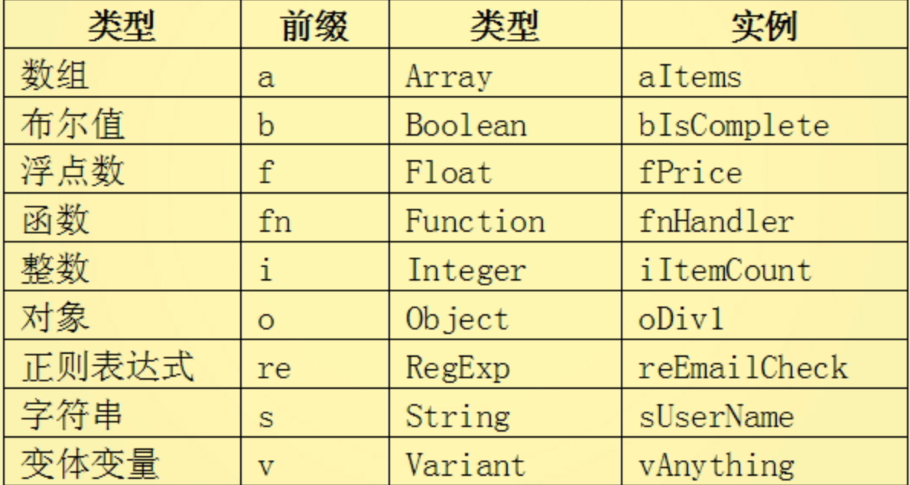

---

匈牙利命名法
*   类型作为变量前缀
*   首字母大写
   

---

模块化

*   模块化基础：匿名闭包IIFE
*   加载：Lab.js
*   YUI——合并压缩混淆
*   Common.js
*   AMD——同步引入 / CMD——共同引入  require.js / sea.js
*   Browserify / Webpack 
*   Babel ES6

